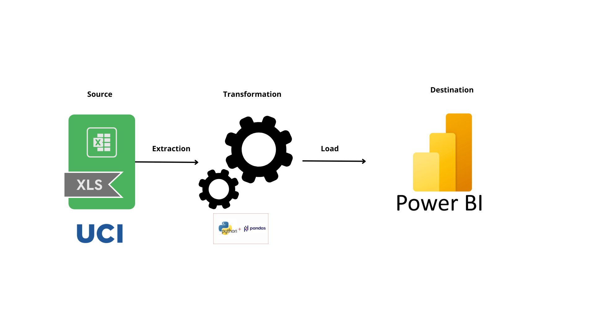

# Data Portfolio: Segmentation du comportement des clients




# Table of contents 

- [Objectif](#objective)
- [Data Source](#data-source)
- [Stages](#stages)
- [Design](#design)
  - [Mockup](#mockup)
  - [Tools](#tools)
- [Development](#development)
  - [Pseudocode](#pseudocode)
  - [Data Exploration](#data-exploration)
  - [Data Cleaning](#data-cleaning)
  - [Transform the Data](#transform-the-data)
  - [Create the SQL View](#create-the-sql-view)
- [Testing](#testing)
  - [Data Quality Tests](#data-quality-tests)
- [Visualization](#visualization)
  - [Results](#results)
  - [DAX Measures](#dax-measures)
- [Analysis](#analysis)
  - [Findings](#findings)
  - [Validation](#validation)
  - [Discovery](#discovery)
- [Recommendations](#recommendations)
  - [Potential ROI](#potential-roi)
  - [Potential Courses of Actions](#potential-courses-of-actions)
- [Conclusion](#conclusion)


# Objective 

- Quel est le principal problème ?

Les responsables marketing veulent comprendre comment segmenter efficacement leurs clients pour connaître les clients les plus rentable afin de mieux cibler leurs campagnes marketing et maximiser leur retour sur investissement.

- Quelle est la solution idéale ? 

Créer un tableau de bord qui permet de:
- visualiser la distribution des clients selon les scores RFM
- comparer les segments en termes de nombre de clients, fréquence d'achat, et montant dépensé.
- analyser les relations entre les dimensions R, F, et M.
- montrer la répartition des revenus par segment.

Cela permettra à l'équipe marketing de prendre des décisions éclairées sur la manière de cibler les différents segments de clients avec des campagnes marketing adaptées, afin de maximiser le retour sur investissement et améliorer la satisfaction clientèle


## User story 

En tant que responsable marketing, je souhaite utiliser un tableau de bord qui analyse les données d'achat des clients.

Ce tableau de bord devrait me permettre d'identifier les segments de clients les pus rentables basés sur la récence, la fréquence et le montant total des achats (RFM).

Avec ces informations, je peux prendre des décisions plus éclairées sur la manière de cibler les différents segments de clients avec des campagnes marketing adaptées, afin de maximiser l'efficacité de chaque campagne et d'améliorer la satisfaction client.


# Data source 

- Quelles données sont nécessaires pour atteindre notre objectif ?

Nous avons besoin des données d'achat sur le site incluant:
- l'id du client
- la date d'achat
- le montant d'achat
- le pays d'achat

D'où les données viennent?

Les données viennent de la plateforme UCI (Excel), ([https://archive.ics.uci.edu/dataset/352/online+retail](https://archive.ics.uci.edu/static/public/352/online+retail.zip))


# Stages

- Design
- Developement
- Test
- Analyse 
 


# Design 

## Composant requis pour le dasboard 
- Que doit contenir le tableau de bord en fonction des exigences fournies ?
Pour comprendre ce qu'il doit contenir, nous devons déterminer à quelles questions le tableau de bord doit répondre :

1. Quels sont les segments de clients les plus rentables ?
2. Quelle est la distribution des clients selon les segments RFM ?
3. Quel est le comportement d'achat des différents segments de clients ?
4. Comment évoluent les segments de clients au fil du temps ?
5. Quels segments de clients ont le potentiel de devenir plus rentables ?
6. Quels clients nécessitent des efforts de réactivation ?

Pour l’instant, ce sont quelques-unes des questions auxquelles nous devons répondre. Cela pourrait changer à mesure que nous progressons dans notre analyse.

## Dashboard mockup

- A quoi ça devrait ressembler ?
  
Certains des visuels de données qui peuvent être appropriés pour répondre à nos questions comprennent :
1. Table
2. Diagramme à secteurs
3. Diagramme à barres
4. Diagramme à points 


## Tools 


| Tool | Purpose |
| --- | --- |
| Excel | Exploring the data |
| Pandas | Cleaning, testing, and analyzing the data |
| Streamlit | Visualizing the data via interactive dashboards |
| GitHub | Hosting the project documentation and version control |
| Mokkup AI | Designing the wireframe/mockup of the dashboard | 


# Development

## Pseudocode

- Quelle est l'approche générale dans la création de cette solution du début à la fin ?

1. Récupérer les données
2. Explorer ces données dans Excel
3. Charger ces données dans un dataframe pandas
4. Nettoyer les données avec pandas
5. Tester les données avec pandas
6. Transformer les données avec pandas et k-mean
7. Visualiser les données avec stremlit
8. Générer les résultats basés sur les informations
9. Rédiger la documentation + commentaire
10. Publiez les données sur la page GitHubs

## Data exploration notes

C'est l'étape où vous avez une analyse du contenu des données, des erreurs, des incohérences, des bugs, des caractères étranges et corrompus, etc.

- Quelles sont vos premières observations avec cet ensemble de données ? Qu’est-ce qui a retenu votre attention jusqu’à présent ?

1. Il y a au moins 4 colonnes contenant les données dont nous avons besoin pour cette analyse, ce qui indique que nous avons tout ce dont nous avons besoin dans le fichier sans avoir besoin de contacter le client pour plus de données. 
2. La quatrième colonne (Quantity) contient la quantité de produits achetés mais elle présente également des valeurs négatives dû aux retours de prodits.
3. Nous avons plus de données que nécessaire, il faudrait donc supprimer certaines de ces colonnes


## Data cleaning et transform
- À quoi attendons-nous que les données propres ressemblent ? (Que doit-il contenir ? Quelles contraintes doit-on lui appliquer ?)

L’objectif est d’affiner notre ensemble de données pour garantir qu’il est structuré et prêt à être analysé.

Les données nettoyées doivent répondre aux critères et contraintes suivants :

- Seules les colonnes pertinentes doivent être conservées.
- Tous les types de données doivent être adaptés au contenu de chaque colonne.
- Aucune colonne ne doit contenir des valeurs nulles, indiquant des données complètes pour tous les enregistrements.

Vous trouverez ci-dessous un tableau décrivant les contraintes sur notre ensemble de données nettoyé :

| Property | Description |
| --- | --- |
| Nombre de Colonne | 4 |

Et voici une représentation tabulaire du schéma attendu pour les données propres :

| Column Name | Data Type | Nullable |
| --- | --- | --- |
| Quantity | INTEGER | NO |
| InvoiceDate | DATETIME | NO |
| UnitPrice | FLOAT | NO |
| CustomerId | INTEGER | NO |


- Quelles étapes sont nécessaires pour nettoyer et mettre en forme les données dans le format souhaité ?

1. Enlever les colonnes non nécéssaires
2. Extraire les lignes n'ayant que Quantity positif
3. Ajouter les colonnes en calculant, la récence, la fréquence et le montant par Customer
4. Prédire les clusters
5. Créer un dataframe avec la moyenne de recence, le montant et fréquence par cluster


### Vérification des données 

```python
# Extraction des lignes avec des quantités positives
positive_quantities = df[df['Quantity'] >= 0]

# Formatage de la colonne InvoiceDate en datetime
positive_quantities['InvoiceDate'] = pd.to_datetime(
    positive_quantities['InvoiceDate'])

# Suppression des colonnes inutiles
positive_quantities = positive_quantities.drop(
    columns=['StockCode', 'Description', 'Country'])

```


### Nettoyage 

```python
# Extraction des lignes avec des quantités positives
positive_quantities = df[df['Quantity'] >= 0]

# Formatage de la colonne InvoiceDate en datetime
positive_quantities['InvoiceDate'] = pd.to_datetime(
    positive_quantities['InvoiceDate'])

# Suppression des colonnes inutiles
positive_quantities = positive_quantities.drop(
    columns=['StockCode', 'Description', 'Country'])

```

### Transformation 

```python
# Formatage de la colonne InvoiceDate en datetime
positive_quantities['InvoiceDate'] = pd.to_datetime(
    positive_quantities['InvoiceDate'])

# Formatage de la colonne InvoiceDate en datetime
positive_quantities['InvoiceDate'] = pd.to_datetime(
    positive_quantities['InvoiceDate'])

# Calcul du montant total par transaction et ajout de la colonne TotalPrice
positive_quantities['TotalPrice'] = positive_quantities['UnitPrice'] * positive_quantities['Quantity']

## Calcul de la récence, fréquence et montant
# Calcul de la date de référence
reference_date = pd.to_datetime('2010-12-01')
# Calculer la récence
recency = positive_quantities.groupby('CustomerID').agg({
    'InvoiceDate': lambda x: (reference_date - x.max()).days
}).rename(columns={'InvoiceDate': 'Recency'})
# Calculer la fréquence
frequency = positive_quantities.groupby('CustomerID').agg({
    'InvoiceDate': 'nunique'
}).rename(columns={'InvoiceDate': 'Frequency'})
# Calculer le montant
monetary = positive_quantities.groupby('CustomerID').agg({
    'TotalPrice': 'sum'
}).rename(columns={'TotalPrice': 'Monetary'})

```
